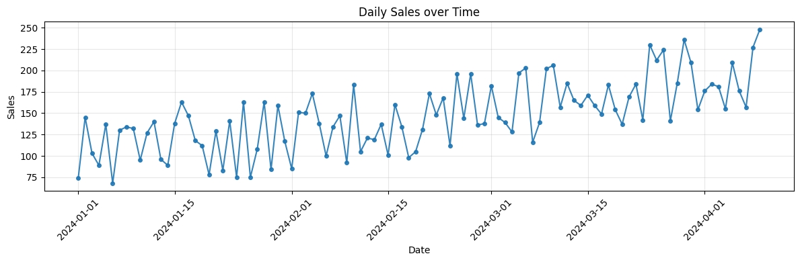
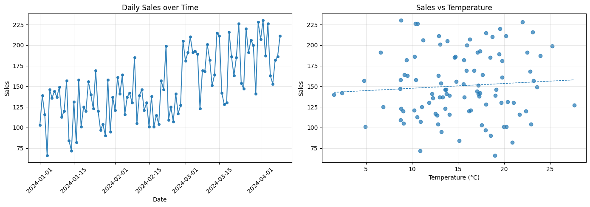
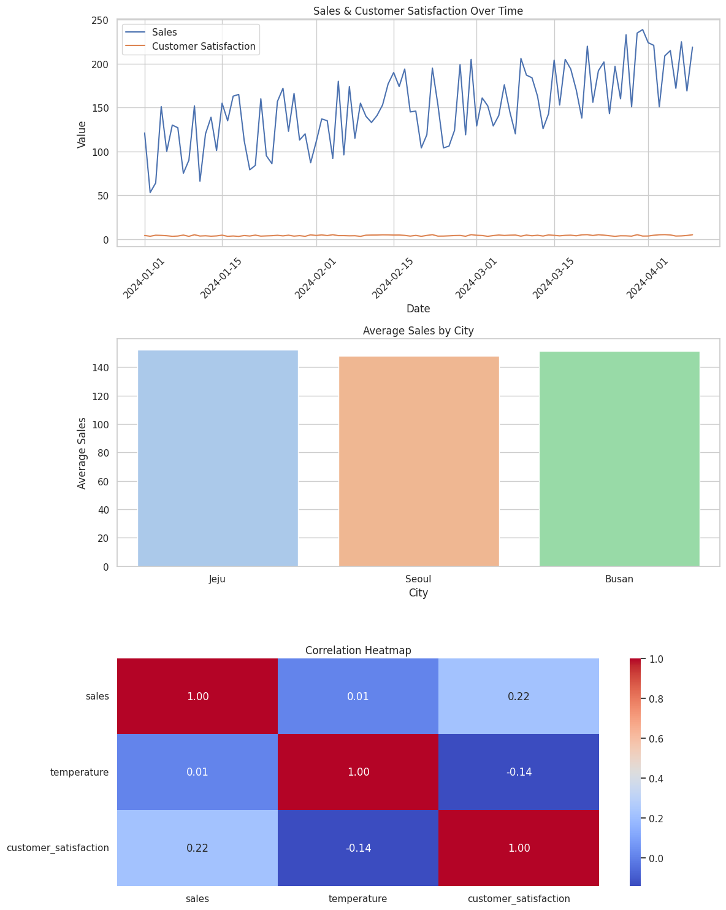

# Day 09: 데이터 시각화 기초 (Matplotlib & Seaborn)

## 🎯 학습 목표

  - Pandas DataFrame 데이터를 기반으로 기본적인 시각화를 수행하여 데이터의 패턴과 인사이트를 도출하는 능력 확보.

### ✔️ 오늘 할 일

  - **Matplotlib 기초 (1.5시간)**
      - `plt.plot()`, `plt.scatter()`, `plt.hist()`, `plt.bar()` 등 기본적인 차트 그리기.
  - **차트 꾸미기 (1시간)**
      - 제목, 축 레이블, 범례, 색상, 스타일 설정.
      - `plt.figure()`와 `plt.subplot()`을 이용한 여러 차트 배치.
  - **Seaborn 활용 (1.5시간)**
      - `sns.scatterplot()`, `sns.lineplot()`, `sns.barplot()`, `sns.heatmap()` 등 고급 시각화 맛보기.

-----

### 📝 실습 문제 및 요구사항

#### 데이터 준비

아래 코드를 실행하여 실습에 사용할 데이터프레임 `df`를 생성합니다.

```python
import pandas as pd
import numpy as np

data = {
    'date': pd.to_datetime(pd.date_range(start='2024-01-01', periods=100, freq='D')),
    'sales': np.random.randint(50, 150, 100) + np.arange(100),
    'temperature': np.random.normal(15, 5, 100),
    'product': np.random.choice(['A', 'B', 'C'], 100),
    'city': np.random.choice(['Seoul', 'Busan', 'Jeju'], 100),
    'customer_satisfaction': np.random.uniform(3, 5, 100)
}
df = pd.DataFrame(data)
df.set_index('date', inplace=True)
```

#### 문제 1: Matplotlib 기본 차트 그리기

  - `sales` 시계열 꺾은선 그래프
  - `sales`와 `temperature`의 관계 산점도
  - `sales` 데이터의 분포 히스토그램

[**정답 코드 보러가기**](https://github.com/xvmon234-ai/Learning-Python/blob/main/CPA%20/my_learing_python%20/Day%209/solutions/coding_1.py)

[**시각화 이미지**]


#### 문제 2: Matplotlib 차트 꾸미기 및 여러 차트 배치하기

  - 1행 2열 서브플롯에 꺾은선 그래프와 산점도 배치
  - 각 차트에 제목, 레이블, 스타일 적용

[**정답 코드 보러가기**](https://github.com/xvmon234-ai/Learning-Python/blob/main/CPA%20/my_learing_python%20/Day%209/solutions/coding_2.py)

[**시각화 이미지**]


#### 문제 3: Seaborn 고급 시각화 활용

  - `sales`와 `customer_satisfaction` 추이 시각화
  - 도시별 평균 `sales` 막대 그래프
  - 숫자형 변수들의 상관관계 히트맵

[**정답 코드 보러가기**](https://github.com/xvmon234-ai/Learning-Python/blob/main/CPA%20/my_learing_python%20/Day%209/solutions/coding_3.py)

[**시각화 이미지**]

