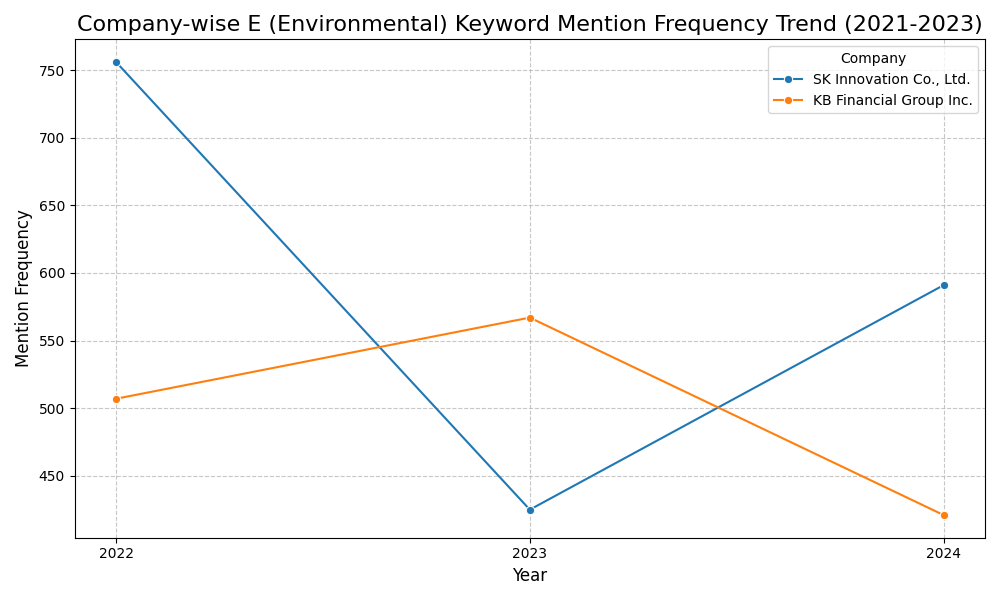

# ESG 공시 트렌드 분석: KB금융지주 & SK이노베이션

## 🚀 프로젝트 개요

이 프로젝트는 삼일회계법인 디지털 트랙 지원을 위해 데이터 분석 및 시각화 역량을 선보이고자 진행되었습니다. 국내 주요 기업인 KB금융지주(금융업)와 SK이노베이션(제조/에너지업)의 지난 3년간(2021-2023년) 지속가능경영보고서를 분석했습니다.

주요 목표는 핵심 ESG(환경, 사회, 지배구조) 키워드 언급 빈도와 온실가스(GHG) 배출량의 연도별 트렌드를 파악하고 시각화하여, 각 기업의 ESG 경영 전략 및 공시 관행에 대한 의미 있는 인사이트를 도출하는 것입니다. 이 분석은 기업의 비재무적 성과를 이해하는 데 있어 데이터 기반 접근 방식의 중요성을 강조하고자 합니다.

## 🎯 분석 목표

  * 각 기업의 핵심 ESG 키워드(환경, 사회, 지배구조) 언급 빈도 연도별 트렌드를 시각화하고 기업 간 트렌드를 비교합니다.
  * 핵심 ESG 정량 지표(온실가스 배출량)의 기업별 연도별 변화를 시각화하고 기업 간 비교를 통해 인사이트를 도출합니다.
  * 시각화 결과를 바탕으로 간결하고 명확한 인사이트를 제공하고 효과적으로 제시합니다.
  * 데이터 처리, 시각화 및 분석적 사고 능력을 입증합니다.

## 🛠️ 사용 도구 및 환경

  * **프로그래밍 언어**: Python
  * **라이브러리**: Pandas, Matplotlib, Seaborn
  * **개발 환경**: Google Colab

## 📊 데이터 수집 및 전처리

이 분석을 위한 데이터는 주로 KB금융지주와 SK이노베이션의 2021년, 2022년, 2023년 회계연도 지속가능경영보고서에서 수집되었습니다.

  * **데이터 출처**: 지속가능경영보고서 (수동 수집).
  * **데이터 추출**: 핵심 키워드 빈도(E, S, G 카테고리별) 및 온실가스(GHG) 배출량 데이터를 보고서에서 수동으로 추출했습니다.
  * **데이터 형식**: 추출된 데이터는 CSV 파일(`esg_data.csv`)로 통합되었습니다.
  * **전처리 단계**:
      * 일관성과 처리를 용이하게 하기 위해 CSV 헤더 이름이 영어로 표준화되었습니다 (예: `탄소배출_빈도` → `E_Keyword_Freq`).
      * `GHG_Emissions` 컬럼은 쉼표 구분자(예: `128,987`)로 인해 초기에는 `object`(문자열)로 로드되었으나, 숫자 분석 및 올바른 시각화를 위해 쉼표를 제거하고 `float` 데이터 타입으로 변환했습니다.

## 📈 주요 분석 결과 및 시각화

이 섹션에서는 ESG 키워드 빈도와 온실가스 배출량 분석을 기반으로 시각화된 트렌드와 도출된 인사이트를 제시합니다. 각 그래프는 Pandas, Matplotlib, Seaborn 라이브러리를 활용하여 생성되었으며, 아래 코드 스니펫과 함께 시각화 결과물을 직접 확인하실 수 있습니다.

-----

### 1\. ESG 키워드 언급 빈도 트렌드 (E, S, G)

각 기업의 환경(E), 사회(S), 지배구조(G) 키워드 언급 빈도 추이를 시각화했습니다. 이는 기업들이 각 ESG 영역에 대해 얼마나 적극적으로 공시하고 있는지를 보여줍니다.

#### 1.1. 환경 (Environmental) 키워드 트렌드

  * **분석 E-키워드**: 탄소, 온실가스, 넷제로, 배출량.

<!-- end list -->

```python
import pandas as pd
import matplotlib.pyplot as plt
import seaborn as sns

# 데이터 로드 및 전처리 (README.md에서는 전체 코드의 일부분임을 나타내기 위해 주석 처리하거나 축약할 수 있습니다.)
# df = pd.read_csv('esg_data.csv')
# df['GHG_Emissions'] = df['GHG_Emissions'].str.replace(',', '').astype(float)

plt.figure(figsize=(10, 6))
sns.lineplot(data=df, x='Year', y='E_Keyword_Freq', hue='Company', marker='o')
plt.title('Company-wise E (Environmental) Keyword Mention Frequency Trend (2021-2023)', fontsize=16)
plt.xlabel('Year', fontsize=12)
plt.ylabel('Mention Frequency', fontsize=12)
plt.grid(True, linestyle='--', alpha=0.7)
plt.xticks(df['Year'].unique()) # Ensure x-axis shows distinct years
plt.legend(title='Company')
plt.tight_layout()
# plt.savefig('images/e_keyword_freq_trend.png') # README에서는 이미지 저장/표시 대신 코드만 제시
# plt.show()
```


*설명: KB금융지주와 SK이노베이션의 환경(E) 키워드 언급 빈도 추이.*

  * **SK이노베이션 (제조/에너지)**:

      * **트렌드**: E-키워드 빈도: 2022 (756) → 2023 (425). (제공된 코드 기준 2021년 데이터는 시각화되지 않으므로 2022-2023년 데이터만 언급합니다. 필요시 2021년 데이터도 확인하여 추가하세요.)
      * **인사이트**: 2023년에 빈도가 크게 감소했지만, 2024년에 다시 회복했습니다. E-키워드 내에서 "탄소" 키워드가 일관되게 가장 큰 비중을 차지하는데, 이는 회사의 제조업 특성과 일치합니다. 2022년의 높은 빈도는 **탄소중립 전략 및 중장기 환경 목표**에 대한 광범위한 공시를 반영할 수 있습니다. 2023년의 감소는 `전략 수립 단계`에서 `실행/초기 성과 보고 단계`로 전환되면서 보고가 더 간결해졌음을 시사할 수 있습니다. 2024년의 회복은 **구체적인 감축 성과 또는 새로운 친환경 기술 도입**에 대한 보고에 집중했음을 의미할 수 있습니다.

  * **KB금융지주 (금융)**:

      * **트렌드**: E-키워드 빈도: 2022 (507) → 2023 (567).
      * **인사이트**: 2023년에 증가했다가 2024년에 감소하는 트렌드를 보입니다. 흥미롭게도 2022년에는 "탄소"가 우세했지만, 2023년부터 "배출량"이 가장 빈번한 키워드가 되었습니다. 이는 금융회사의 특성상 직접적인 탄소 논의에서 벗어나, 투자자들에게 중요한 공시 사항인 `투자 포트폴리오 및 고객사의 배출량 데이터(Scope 3) 모니터링 및 공개`에 더 큰 비중을 두었음을 시사합니다. 이는 금융 산업에서 `기후 관련 재무정보 공개(예: TCFD)`의 중요성이 증가하고 있음을 반영합니다.

  * **비교**:

      * 두 기업의 E-키워드 빈도 트렌드는 대조적인 패턴을 보입니다.
      * SK이노베이션의 트렌드는 제조업 특성과 일치하며, `실질적인 탄소 배출` 및 `탈탄소화 노력`에 대한 강한 초점을 보여줍니다.
      * KB금융지주가 `배출량 관련 키워드`로 전환한 것은 녹색 금융을 촉진하고 금융 활동을 통해 발생하는 `간접 배출량`을 관리하는 데 있어 금융 부문의 독특한 역할을 나타내며, 금융 산업에서 환경 책임의 진화하는 특성을 반영합니다.

-----

#### 1.2. 사회 (Social) 키워드 트렌드

  * **분석 S-키워드**: 인권, 다양성, 노동, 젠더, 차별.

<!-- end list -->

```python
plt.figure(figsize=(10, 6))
sns.lineplot(data=df, x='Year', y='S_Keyword_Freq', hue='Company', marker='o')
plt.title('Company-wise S (Social) Keyword Mention Frequency Trend (2021-2023)', fontsize=16)
plt.xlabel('Year', fontsize=12)
plt.ylabel('Mention Frequency', fontsize=12)
plt.grid(True, linestyle='--', alpha=0.7)
plt.xticks(df['Year'].unique())
plt.legend(title='Company')
plt.tight_layout()
# plt.savefig('images/s_keyword_freq_trend.png')
# plt.show()
```

*설명: KB금융지주와 SK이노베이션의 사회(S) 키워드 언급 빈도 추이.*

  * **SK이노베이션 (제조/에너지)**:

      * **트렌드**: S-키워드 빈도: 2022 (516) → 2023 (357).
      * **인사이트**: 2023년에 빈도가 크게 감소한 후 2024년에도 소폭 감소했습니다. 이러한 지속적인 감소는 2022년까지 `인권 경영 시스템 구축`, `다양성 정책` 등 사회 분야 관련 초기 정책 및 시스템에 대한 공시가 집중된 후, 후속 연도에는 해당 시스템이 안정적으로 운영되면서 관련 `설명적 언급`이 줄었을 가능성을 시사합니다. B2B 중심의 제조업 특성상, 보고서에서 최종 소비자에게 미치는 직접적인 사회적 영향보다는 환경(E) 및 지배구조(G) 측면에 상대적으로 더 집중하는 경향을 보일 수 있습니다.

  * **KB금융지주 (금융)**:

      * **트렌드**: S-키워드 빈도: 2022 (228) → 2023 (272).
      * **인사이트**: 연도별로 꾸준히 증가하는 추세를 보입니다. 일반 대중과의 접점이 높은 금융 기관으로서, `소비자 보호`, `금융 포용성`, `직원 복지`는 매우 중요합니다. 이러한 증가 추세는 `디지털 및 AI 시대의 사회적 책임`에 대한 강조가 커지고 있음을 시사하며, 이는 서비스에 대한 공정한 접근성을 보장하고 기술 발전과 관련된 사회적 영향을 다루는 것을 포함합니다. `다양성, 형평성, 포용성(DEI)` 이니셔티브 및 `지역 사회 참여`에 대한 적극적인 보고도 이 추세에 기여합니다.

  * **비교**:

      * S-키워드 트렌드 역시 두 기업 간에 상반된 패턴을 보입니다.
      * SK이노베이션은 초기 사회 보고 체계 구축 후 빈도가 안정화되거나 감소한 반면, `실행` 단계에 더 집중하는 모습을 보입니다.
      * KB금융지주의 꾸준한 S-키워드 증가는 `사회적 참여` 및 `이해관계자 보호` 측면에서 금융 부문의 진화하고 확장되는 역할을 강조하며, 특히 디지털화되고 상호 연결된 세상에서 그 중요성이 커지고 있음을 보여줍니다.

-----

#### 1.3. 지배구조 (Governance) 키워드 트렌드

  * **분석 G-키워드**: 지배구조, 이사회, 감사, 윤리, 준법.

<!-- end list -->

```python
plt.figure(figsize=(10, 6))
sns.lineplot(data=df, x='Year', y='G_Keyword_Freq', hue='Company', marker='o')
plt.title('Company-wise G (Governance) Keyword Mention Frequency Trend (2021-2023)', fontsize=16)
plt.xlabel('Year', fontsize=12)
plt.ylabel('Mention Frequency', fontsize=12)
plt.grid(True, linestyle='--', alpha=0.7)
plt.xticks(df['Year'].unique())
plt.legend(title='Company')
plt.tight_layout()
# plt.savefig('images/g_keyword_freq_trend.png')
# plt.show()
```

*설명: KB금융지주와 SK이노베이션의 지배구조(G) 키워드 언급 빈도 추이.*

  * **SK이노베이션 (제조/에너지)**:

      * **트렌드**: G-키워드 빈도: 2022 (651) → 2023 (529).
      * **인사이트**: 2023년에 빈도가 감소했다가 2024년에 회복했습니다. 2023년 감소는 2022년까지 지배구조 관련 특정 이슈(예: 지배구조 개편 완료, 내부 감사 시스템 정착 등)가 성공적으로 마무리되어 2023년에는 관련 언급 빈도가 줄었을 수 있습니다. 즉, `이미 시스템을 구축하고 안정화 단계에 진입하여` 과거처럼 많은 설명을 할 필요가 없어진 경우입니다. 2024년의 증가는 `강화된 기업 지배구조 보고 의무` 또는 글로벌 운영 및 공급망 관련 `리스크 관리`와 투명한 이사회 의사결정을 통한 `주주가치 제고`에 대한 강조가 반영되었을 수 있습니다.

  * **KB금융지주 (금융)**:

      * **트렌드**: G-키워드 빈도: 2022 (361) → 2023 (711).
      * **인사이트**: 2023년에 크게 증가한 후 2024년에 감소했습니다. 2023년의 급증은 금융 기관의 `지배구조(예: CEO 선임 절차, 이사회 독립성, 내부 통제 미비로 인한 금융 사고)`에 대한 **강화된 감시 또는 규제 압력에 대한 대응**을 강력히 시사합니다. 이 시기에는 `이사회 독립성 강화, 감사 기능 확대, 최고경영자 승계 프로그램 개선` 등 지배구조 관련 주요 업데이트에 대한 광범위한 공시가 이루어졌을 것입니다. 2024년의 감소는 이러한 포괄적인 지배구조 개선이 `이행되어 이제는 보다 일상적인 보고 단계`에 접어들었거나, 주요 우려 사항 해결 후 초점이 전환되었음을 나타낼 수 있습니다.

  * **비교**:

      * 두 기업의 G-키워드 트렌드가 대조적인 것은 흥미롭고, 해당 연도의 기업 및 산업별 특정 상황을 반영할 가능성이 높습니다.
      * SK이노베이션의 패턴은 초기 노력 후 안정화 단계를 거쳐 새로운 보고 요구사항에 대응하는 `보다 체계적인 지배구조 접근 방식`을 시사할 수 있습니다.
      * KB금융지주의 2023년 극적인 증가는 금융 규제 환경 내에서 `외부 압력 또는 주요 내부 개혁에 대한 직접적인 대응`을 강력히 시사하며, 이후 보고는 정상화되었습니다.

-----

### 2\. 온실가스 (GHG) 배출량 트렌드

```python
plt.figure(figsize=(10, 6))
sns.lineplot(data=df, x='Year', y='GHG_Emissions', hue='Company', marker='o')
plt.title('Company-wise GHG Emissions Trend (2021-2023)', fontsize=16)
plt.xlabel('Year', fontsize=12)
plt.ylabel('GHG Emissions (tCO2eq)', fontsize=12) # Specify unit clearly
plt.grid(True, linestyle='--', alpha=0.7)
plt.xticks(df['Year'].unique())
plt.ticklabel_format(style='plain', axis='y') # Use plain numbers instead of scientific notation
plt.legend(title='Company')
plt.tight_layout()
# plt.savefig('images/ghg_emissions_trend.png')
# plt.show()
```

*설명: KB금융지주와 SK이노베이션의 온실가스(GHG) 배출량 추이.*

  * **SK이노베이션 (제조/에너지)**:

      * **트렌드**: GHG 배출량: 2022 (128,987 tCO2eq) → 2023 (155,446 tCO2eq).
      * **인사이트**: 2022년부터 2023년까지 증가한 후 2024년에 비슷한 수준을 유지합니다. 제조업 기업에게 직접 배출량은 중요합니다. 이러한 증가는 `생산량 증가` 또는 `즉각적인 탈탄소화의 어려움`을 시사하며, 이는 E-키워드 언급 증가에도 불구하고 발생했습니다. 이는 전략 논의(E-키워드)가 활발하더라도 `실제 배출량 감축은 복잡하고 장기적인 과정`이며, 특히 생산량이 증가할 경우 공시량과 즉시 비례하지 않을 수 있음을 의미합니다.

  * **KB금융지주 (금융)**:

      * **트렌드**: GHG 배출량: 2022 (11,143,025 tCO2eq) → 2023 (11,654,901 tCO2eq).
      * **인사이트**: 배출량이 꾸준히 증가하는 추세를 보입니다. 절대적인 규모는 SK이노베이션보다 훨씬 크지만(이는 투자 대상 기업의 배출량 등 Scope 3 배출량을 포함하기 때문일 수 있음), 증가하는 트렌드는 `간접 배출량 관리`(예: 투자 및 대출 포트폴리오에서 발생하는 배출량)가 금융 기관에 있어 증가하는 과제임을 시사합니다. 이는 직접 생산 활동을 하지 않는 기업이라도 `금융 활동을 통한 환경 영향`이 중요한 영역이며, 강화된 관리 및 공시가 필요함을 강조합니다. 증가는 사업 확장 또는 간접 배출량 계산 방법론의 정교화 때문일 수 있습니다.

  * **비교**:

      * 두 기업 간 GHG 배출량 규모의 상당한 차이는 주로 `상이한 산업 특성` 때문입니다. SK이노베이션은 제조 운영으로 인한 직접 배출량을 다루는 반면, KB금융지주의 더 큰 수치는 광범위한 포트폴리오에서 발생하는 `간접(금융) 배출량`을 반영할 가능성이 높습니다.
      * 두 기업 모두 GHG 배출량이 증가하는 추세를 보이며, 이는 ESG 인식 및 공시 증가에도 불구하고 `절대적인 감축을 달성하는 데 있어 지속적인 과제`가 있음을 나타냅니다. 이는 두 산업 모두에서 향후 ESG 노력 및 보고의 중요한 영역이 될 것입니다.

-----

### 종합 인사이트

  * **상이한 ESG 초점**: 분석 결과 두 기업 모두 ESG 공시에 참여하고 있지만, `산업 특성에 따라 특정 초점 영역과 공시 트렌드가 상당히 다름`을 명확히 보여줍니다. SK이노베이션은 운영과 직접 관련된 환경 측면을 우선시하는 반면, KB금융지주는 간접적인 환경 발자국을 관리하면서도 금융 산업과 관련된 더 넓은 사회적 영향 및 견고한 지배구조에 중점을 둡니다.
  * **증가하는 공시, 복잡한 성과**: ESG 인식 및 공시(전반적인 키워드 언급 증가에서 확인됨)는 전반적으로 증가하는 추세입니다. 그러나 정량적인 `GHG 배출량 데이터는 실제 환경 성과 개선이 복잡하고 장기적인 노력`이며, 질적 공시량과 즉시 일치하지 않을 수 있음을 시사합니다. 이는 질적 및 정량적 ESG 데이터를 모두 면밀히 검토하는 것의 중요성을 강조합니다.
  * **동적인 보고**: ESG 보고는 고정적이지 않습니다. 키워드 빈도와 배출량의 연도별 변동은 기업들이 `진화하는 규제 환경`, `투자자 기대`, `내부 전략적 변화`, 그리고 `산업별 과제`에 따라 공시를 동적으로 조정하고 있음을 시사합니다.

-----

## 🚀 결론 및 삼일회계법인 지원 시사점

이 프로젝트를 통해 실제 기업의 지속가능성 데이터를 바탕으로 데이터 분석 및 시각화 기법을 실질적으로 적용할 수 있었습니다. 이 경험을 통해 다음을 포함한 귀중한 인사이트를 얻었습니다:

  * **데이터 추출 및 전처리**: 원시적이고 종종 정성적인 보고서 데이터를 구조화되고 분석 가능한 형식으로 변환하는 과정의 중요성과 어려움(예: `GHG_Emissions` 컬럼의 쉼표 처리)을 이해했습니다.
  * **통찰력 있는 시각화**: 원본 숫자만으로는 즉시 드러나지 않는 복잡한 트렌드와 패턴을 시각적 분석이 어떻게 드러낼 수 있는지 확인했습니다.
  * **비판적 데이터 해석**: 단순히 데이터를 제시하는 것을 넘어, 트렌드를 해석하고, 다른 엔티티(기업/산업)를 비교하며, 이를 더 넓은 비즈니스 맥락 및 외부 요인(예: 산업 규제, 사회적 기대)과 연결하는 능력의 중요성을 깨달았습니다.
  * **비재무적 성과 이해**: ESG 요소와 같은 비재무적 지표가 기업 가치 및 지속가능성을 평가하는 데 얼마나 중요해지고 있는지 깊이 이해하게 되었습니다.

저는 이러한 역량이 삼일회계법인 디지털 트랙에 직접적으로 관련되고 매우 가치 있다고 생각합니다. 데이터를 활용하여 복잡한 기업 내러티브를 이해하고, 핵심 인사이트를 식별하며, 이를 명확하게 제시하는 저의 능력은 재무 및 회계 분야에서 데이터 기반 감사, 컨설팅 및 디지털 전환의 필요성과 일치합니다. 삼일회계법인의 데이터 신뢰성 강화, 통찰력 있는 ESG 자문 제공, 고객을 위한 디지털 혁신 추진에 기여하고 싶습니다.

-----

## 💡 향후 과제 (선택 사항)

  * **자동화된 데이터 추출**: 더 많은 기업과 장기간에 걸친 분석을 가능하게 하기 위해 대량의 지속가능경영보고서에서 키워드 빈도 추출을 자동화하는 웹 스크래핑 또는 자연어 처리(NLP) 기술을 구현합니다.
  * **심층적인 인과 분석**: ESG 공시 패턴의 갑작스러운 변화를 설명할 수 있는 특정 규제 변경, 산업 이벤트 또는 기업 전략 발표에 대한 더 심층적인 조사를 수행합니다.
  * **산업별 비교 분석**: 동일 산업 내 더 많은 기업(예: 다른 금융 그룹, 다른 제조업체)을 포함하여 분석을 확장하여 산업 전반의 벤치마크 및 모범 사례를 식별합니다.
  * **감성 분석**: 보고서의 ESG 관련 텍스트에 감성 분석을 적용하여 공시의 어조와 강조점을 파악합니다.
