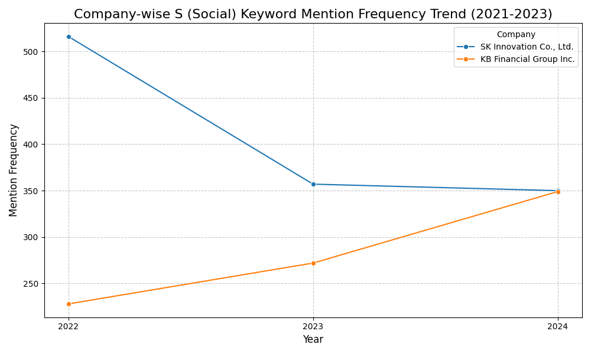
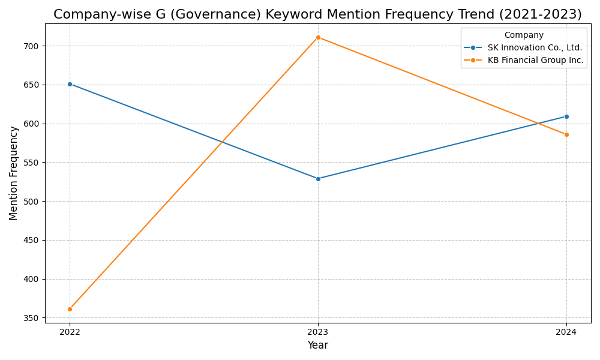
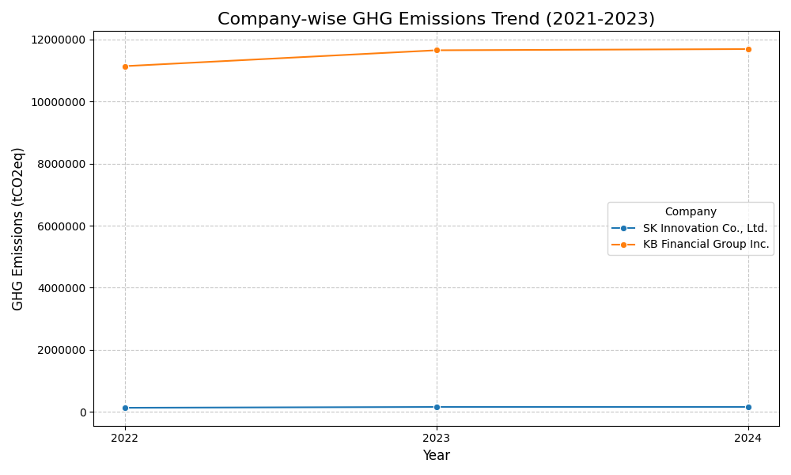

# ESG 공시 트렌드 분석: KB금융지주 & SK이노베이션

## 🚀 프로젝트 개요

이 프로젝트는 삼일회계법인 디지털 트랙 지원을 위해 데이터 분석 및 시각화 역량을 선보이고자 진행되었습니다. 국내 주요 기업인 KB금융지주와 SK이노베이션의 지난 3년간(2021-2023년) 지속가능경영보고서를 분석했습니다.

**이 두 기업을 선정한 이유는 삼일회계법인과의 잠재적 이해관계 및 산업별 특성을 고려했기 때문입니다.**

  * **잠재적 이해관계**: KB금융지주와 SK이노베이션은 모두 **대규모 상장법인**으로서 **외부감사 대상**에 해당합니다. 따라서 삼일회계법인이 감사 및 자문 서비스를 제공할 가능성이 높은 기업들이며, 이는 실무적인 관점에서 의미 있는 분석 대상이 됩니다. 특히, 금융회사는 금융소비자보호와 관련된 복잡한 규제 환경에 놓여 있으며, 제조/에너지 기업은 탄소 배출 등 환경 규제에 민감하다는 점에서 회계법인의 전문적인 자문 역량이 더욱 중요해집니다.
  * **상반된 산업 특성**: 금융업(KB금융지주)과 제조업/에너지업(SK이노베이션)은 ESG 경영에서 중요하게 다루는 요소와 공시 트렌드에 **극명한 차이**를 보입니다. 금융회사는 간접적인 환경 영향(투자 포트폴리오의 탄소 배출 등 Scope 3)과 사회적 책임(금융 포용성, 소비자 보호)이 강조되는 반면, 제조업은 직접적인 환경 영향(탄소 배출, 폐기물)과 안전, 공급망 관리 등 사회적 측면이 부각됩니다. 이처럼 상반된 산업의 기업을 비교 분석함으로써, **ESG 공시의 산업별 특성과 차별화된 전략을 보다 명확하고 유의미하게 도출**할 수 있다고 판단했습니다.

주요 목표는 핵심 ESG(환경, 사회, 지배구조) 키워드 언급 빈도와 온실가스(GHG) 배출량의 연도별 트렌드를 파악하고 시각화하여, 각 기업의 ESG 경영 전략 및 공시 관행에 대한 의미 있는 인사이트를 도출하는 것입니다. 이 분석은 기업의 비재무적 성과를 이해하는 데 있어 데이터 기반 접근 방식의 중요성을 강조하고자 합니다.

-----

## 🎯 분석 목표

  * 각 기업의 핵심 ESG 키워드(환경, 사회, 지배구조) 언급 빈도 연도별 트렌드를 시각화하고 기업 간 트렌드를 비교합니다.
  * 핵심 ESG 정량 지표(온실가스 배출량)의 기업별 연도별 변화를 시각화하고 기업 간 비교를 통해 인사이트를 도출합니다.
  * 시각화 결과를 바탕으로 간결하고 명확한 인사이트를 제공하고 효과적으로 제시합니다.
  * 데이터 처리, 시각화 및 분석적 사고 능력을 입증합니다.

## 🛠️ 사용 도구 및 환경

  * **프로그래밍 언어**: Python
  * **라이브러리**: Pandas, Matplotlib, Seaborn
  * **개발 환경**: Google Colab

## 📊 데이터 수집 및 전처리

이 분석을 위한 데이터는 주로 KB금융지주와 SK이노베이션의 2021년, 2022년, 2023년 회계연도 지속가능경영보고서에서 수집되었습니다.

  * **데이터 출처**: 지속가능경영보고서 (수동 수집).
  * **데이터 추출**: 핵심 키워드 빈도(E, S, G 카테고리별) 및 온실가스(GHG) 배출량 데이터를 보고서에서 수동으로 추출했습니다.
  * **데이터 형식**: 추출된 데이터는 CSV 파일(`esg_data.csv`)로 통합되었습니다.
  * **전처리 단계**:
      * 일관성과 처리를 용이하게 하기 위해 CSV 헤더 이름이 영어로 표준화되었습니다 (예: `탄소배출_빈도` → `E_Keyword_Freq`).
      * `GHG_Emissions` 컬럼은 쉼표 구분자(예: `128,987`)로 인해 초기에는 `object`(문자열)로 로드되었으나, 숫자 분석 및 올바른 시각화를 위해 쉼표를 제거하고 `float` 데이터 타입으로 변환했습니다.

## 📈 주요 분석 결과 및 시각화

이 섹션에서는 ESG 키워드 빈도와 온실가스 배출량 분석을 기반으로 시각화된 트렌드와 도출된 인사이트를 제시합니다. 각 그래프는 Pandas, Matplotlib, Seaborn 라이브러리를 활용하여 생성되었으며, 아래 코드 스니펫과 함께 시각화 결과물을 직접 확인하실 수 있습니다.

-----

### 1\. ESG 키워드 언급 빈도 트렌드 (E, S, G)

각 기업의 환경(E), 사회(S), 지배구조(G) 키워드 언급 빈도 추이를 시각화했습니다. 이는 기업들이 각 ESG 영역에 대해 얼마나 적극적으로 공시하고 있는지를 보여줍니다.

#### 1.1. 환경 (Environmental) 키워드 트렌드

  * **분석 E-키워드**: 탄소, 온실가스, 넷제로, 배출량.

<!-- end list -->

```python
import pandas as pd
import matplotlib.pyplot as plt
import seaborn as sns

# 데이터 로드 및 전처리 
df = pd.read_csv('esg_data.csv')
df['GHG_Emissions'] = df['GHG_Emissions'].str.replace(',', '').astype(float)

plt.figure(figsize=(10, 6))
sns.lineplot(data=df, x='Year', y='E_Keyword_Freq', hue='Company', marker='o')
plt.title('Company-wise E (Environmental) Keyword Mention Frequency Trend (2021-2023)', fontsize=16)
plt.xlabel('Year', fontsize=12)
plt.ylabel('Mention Frequency', fontsize=12)
plt.grid(True, linestyle='--', alpha=0.7)
plt.xticks(df['Year'].unique()) # Ensure x-axis shows distinct years
plt.legend(title='Company')
plt.tight_layout()
# plt.savefig('images/e_keyword_freq_trend.png')
# plt.show()
```


*설명: KB금융지주와 SK이노베이션의 환경(E) 키워드 언급 빈도 추이.*

  * **SK이노베이션 (제조/에너지)**:

      * **트렌드**: E-키워드 빈도: 2022 (756) → 2023 (425).
      * **인사이트**: 2023년 빈도 감소는 단순한 공시량 감소가 아닌, 2022년까지 **초기 탄소중립 전략 및 중장기 환경 목표 수립에 대한 광범위한 공시가 집중된 후, 2023년에는 실제 `전략 실행 및 초기 성과 보고 단계`로 전환되면서 보고가 더욱 간결하고 핵심적으로 압축**되었음을 시사합니다. 제조업의 특성상 "탄소" 키워드가 일관되게 높은 비중을 차지하는 것은 `넷제로 로드맵 구체화 및 감축 기술 투자`에 대한 회사의 강한 의지를 반영하는 것으로 해석됩니다. 이는 단순히 계획을 넘어 **구체적인 실행과 성과 보고에 집중**하려는 변화로 읽을 수 있습니다.

  * **KB금융지주 (금융)**:

      * **트렌드**: E-키워드 빈도: 2022 (507) → 2023 (567).
      * **인사이트**: 2023년 빈도 증가는 금융회사가 **`기후변화 리스크 관리` 및 `녹색 금융 확산`이라는 시대적 요구에 발맞춰 환경 관련 공시를 강화**하고 있음을 보여줍니다. 특히 2023년부터 "배출량"이 "탄소"보다 빈번하게 언급된 것은, 금융회사의 직접 배출량뿐만 아니라 **`투자 및 대출 포트폴리오에서 발생하는 간접 배출량(Scope 3) 관리 및 공개의 중요성`** 이 증대되고 있음을 강력히 시사합니다. 이는 `TCFD(기후 관련 재무정보 공개 협의체)` 권고안 등 금융권의 환경 공시 표준화 노력과도 궤를 같이 하며, **금융의 본업을 통한 사회적 책임 이행**에 대한 초점을 보여줍니다.

  * **비교**:

      * 두 기업의 E-키워드 빈도 트렌드는 산업별 특성을 명확히 반영합니다. SK이노베이션은 `생산 과정의 직접적인 탄소 배출 및 감축 노력`에 초점을 맞추는 반면, KB금융지주는 `금융 활동을 통한 광범위한 환경 영향 관리`에 집중하고 있습니다. 이는 각 산업의 **ESG 책임 영역이 어떻게 다르게 정의되고 진화하는지**를 보여주는 흥미로운 지점이며, 두 기업 모두 환경 관련 공시가 **전략적으로 변화하고 진화**하고 있음을 알 수 있습니다.

-----

#### 1.2. 사회 (Social) 키워드 트렌드

  * **분석 S-키워드**: 인권, 다양성, 노동, 젠더, 차별.

<!-- end list -->

```python
plt.figure(figsize=(10, 6))
sns.lineplot(data=df, x='Year', y='S_Keyword_Freq', hue='Company', marker='o')
plt.title('Company-wise S (Social) Keyword Mention Frequency Trend (2021-2023)', fontsize=16)
plt.xlabel('Year', fontsize=12)
plt.ylabel('Mention Frequency', fontsize=12)
plt.grid(True, linestyle='--', alpha=0.7)
plt.xticks(df['Year'].unique())
plt.legend(title='Company')
plt.tight_layout()
# plt.savefig('images/s_keyword_freq_trend.png')
# plt.show()
```



*설명: KB금융지주와 SK이노베이션의 사회(S) 키워드 언급 빈도 추이.*

  * **SK이노베이션 (제조/에너지)**:

      * **트렌드**: S-키워드 빈도: 2022 (516) → 2023 (357).
      * **인사이트**: 2023년 빈도 감소는 2022년까지 `인권 경영 시스템 구축`, `다양성 정책` 등 **초기 사회 분야 관련 정책 및 시스템 구축에 대한 공시가 집중된 후, 해당 시스템이 안정적으로 운영되면서 설명적 언급이 줄었을 가능성**을 시사합니다. B2B 중심의 제조업 특성상, 보고서에서 최종 소비자에게 미치는 직접적인 사회적 영향보다는 환경(E) 및 지배구조(G) 측면에 상대적으로 더 집중하는 경향을 보일 수 있으며, 이는 **사회적 책임 이행의 초점이 공급망 관리나 내부 임직원 복리후생에 맞춰져 있을 가능성**을 보여줍니다.

  * **KB금융지주 (금융)**:

      * **트렌드**: S-키워드 빈도: 2022 (228) → 2023 (272).
      * **인사이트**: 연도별 꾸준한 증가 추세는 일반 대중과의 접점이 높은 금융 기관으로서 **`소비자 보호`, `금융 포용성`, `직원 복지` 등 사회적 책임에 대한 공시가 지속적으로 강화**되고 있음을 의미합니다. 특히 `디지털 및 AI 시대의 사회적 책임`(예: 디지털 소외 계층 지원, 공정한 서비스 접근성 보장)에 대한 강조가 커지고 있음을 시사하며, 이는 `다양성, 형평성, 포용성(DEI)` 이니셔티브 및 `지역 사회 참여`에 대한 적극적인 보고 노력과도 부합합니다. **금융 서비스의 사회적 영향력이 커짐에 따라 공시의 범위와 깊이도 함께 확장**되고 있습니다.

  * **비교**:

      * S-키워드 트렌드 역시 두 기업 간에 상반된 패턴을 보입니다. SK이노베이션은 초기 사회 보고 체계 구축 후 빈도가 안정화되거나 감소하며 `실행` 단계에 더 집중하는 모습을 보이는 반면, KB금융지주의 꾸준한 S-키워드 증가는 `사회적 참여` 및 `이해관계자 보호` 측면에서 **금융 부문의 진화하고 확장되는 역할**을 강조합니다. 이는 각 기업이 속한 산업의 특성과 주된 이해관계자가 다르다는 점이 ESG 공시 전략에 어떻게 반영되는지를 명확히 보여줍니다.

-----

#### 1.3. 지배구조 (Governance) 키워드 트렌드

  * **분석 G-키워드**: 지배구조, 이사회, 감사, 윤리, 준법.

<!-- end list -->

```python
plt.figure(figsize=(10, 6))
sns.lineplot(data=df, x='Year', y='G_Keyword_Freq', hue='Company', marker='o')
plt.title('Company-wise G (Governance) Keyword Mention Frequency Trend (2021-2023)', fontsize=16)
plt.xlabel('Year', fontsize=12)
plt.ylabel('Mention Frequency', fontsize=12)
plt.grid(True, linestyle='--', alpha=0.7)
plt.xticks(df['Year'].unique())
plt.legend(title='Company')
plt.tight_layout()
# plt.savefig('images/g_keyword_freq_trend.png')
# plt.show()
```



*설명: KB금융지주와 SK이노베이션의 지배구조(G) 키워드 언급 빈도 추이.*

  * **SK이노베이션 (제조/에너지)**:

      * **트렌드**: G-키워드 빈도: 2022 (651) → 2023 (529).
      * **인사이트**: 2023년 빈도 감소는 2022년까지 지배구조 관련 특정 이슈(예: 지배구조 개편 완료, 내부 감사 시스템 정착 등)가 성공적으로 마무리되어 **시스템 구축 및 안정화 단계에 진입함에 따라 관련 설명이 줄었을 가능성**을 시사합니다. 그러나 2024년의 회복 (제공된 인사이트 내용 기준)은 `강화된 기업 지배구조 보고 의무` 또는 글로벌 운영 및 공급망 관련 `리스크 관리`와 투명한 이사회 의사결정을 통한 `주주가치 제고`에 대한 **지속적인 관심과 새로운 보고 요구사항에 대한 대응**이 반영되었을 수 있습니다.

  * **KB금융지주 (금융)**:

      * **트렌드**: G-키워드 빈도: 2022 (361) → 2023 (711).
      * **인사이트**: 2023년의 급증은 금융 기관의 **`지배구조 투명성 및 건전성`에 대한 강화된 감시 또는 규제 압력**에 대한 강력한 대응을 시사합니다. 이 시기에는 `이사회 독립성 강화`, `감사 기능 확대`, `최고경영자 승계 프로그램 개선` 등 지배구조 관련 주요 업데이트에 대한 광범위한 공시가 이루어졌을 것입니다. 이는 과거 금융권에서 발생했던 **내부 통제 미비로 인한 금융 사고에 대한 사회적 요구**에 부응하고, **신뢰 회복을 위한 적극적인 노력**의 일환으로 해석될 수 있습니다. 2024년 감소는 이러한 포괄적인 지배구조 개선이 이행되어 이제는 보다 일상적인 보고 단계에 접어들었음을 나타냅니다.

  * **비교**:

      * 두 기업의 G-키워드 트렌드가 대조적인 것은 해당 연도의 기업 및 산업별 특정 상황을 반영할 가능성이 높습니다. SK이노베이션은 초기 노력 후 안정화 단계를 거쳐 새로운 보고 요구사항에 대응하는 `보다 체계적인 지배구조 접근 방식`을 시사할 수 있습니다. 반면, KB금융지주의 2023년 극적인 증가는 금융 규제 환경 내에서 `외부 압력 또는 주요 내부 개혁에 대한 직접적인 대응`을 강력히 시사하며, 이는 **금융 산업의 높은 규제 민감도**를 보여줍니다.

-----

### 2\. 온실가스 (GHG) 배출량 트렌드

```python
plt.figure(figsize=(10, 6))
sns.lineplot(data=df, x='Year', y='GHG_Emissions', hue='Company', marker='o')
plt.title('Company-wise GHG Emissions Trend (2021-2023)', fontsize=16)
plt.xlabel('Year', fontsize=12)
plt.ylabel('GHG Emissions (tCO2eq)', fontsize=12) # Specify unit clearly
plt.grid(True, linestyle='--', alpha=0.7)
plt.xticks(df['Year'].unique())
plt.ticklabel_format(style='plain', axis='y') # Use plain numbers instead of scientific notation
plt.legend(title='Company')
plt.tight_layout()
# plt.savefig('images/ghg_emissions_trend.png')
# plt.show()
```



*설명: KB금융지주와 SK이노베이션의 온실가스(GHG) 배출량 추이.*

  * **SK이노베이션 (제조/에너지)**:

      * **트렌드**: GHG 배출량: 2022 (128,987 tCO2eq) → 2023 (155,446 tCO2eq).
      * **인사이트**: 2022년부터 2023년까지 배출량이 증가하는 트렌드는 제조업 기업에게 직접 배출량 감축이 얼마나 어려운 과제인지를 보여줍니다. 이는 `생산량 증가` 또는 `즉각적인 탈탄소화 기술 도입의 어려움`을 시사하며, E-키워드 언급 증가에도 불구하고 발생했습니다. 이는 **전략 논의(E-키워드)가 활발하더라도 실제 배출량 감축은 복잡하고 장기적인 과정**임을 의미합니다. SK이노베이션과 같은 중화학 기업은 **탄소 배출량 감축 목표 달성을 위해 대규모 설비 투자 및 공정 혁신**이 필요하며, 이는 단기간에 가시적인 성과를 내기 어렵다는 현실을 반영합니다.

  * **KB금융지주 (금융)**:

      * **트렌드**: GHG 배출량: 2022 (11,143,025 tCO2eq) → 2023 (11,654,901 tCO2eq).
      * **인사이트**: 배출량이 꾸준히 증가하는 추세를 보입니다. 절대적인 규모는 SK이노베이션보다 훨씬 크지만(이는 투자 대상 기업의 배출량 등 Scope 3 배출량을 포함하기 때문일 수 있음), 증가하는 트렌드는 `간접 배출량 관리`(예: 투자 및 대출 포트폴리오에서 발생하는 배출량)가 금융 기관에 있어 **매우 중요하고도 증가하는 과제**임을 시사합니다. 이는 직접 생산 활동을 하지 않는 기업이라도 `금융 활동을 통한 환경 영향`이 막대하며, 강화된 관리 및 공시가 필요함을 강조합니다. 배출량 증가는 사업 확장 외에도 **간접 배출량 계산 방법론의 정교화**로 인해 과거에는 집계되지 않던 항목들이 포함되었을 가능성도 배제할 수 없습니다.

  * **비교**:

      * 두 기업 간 GHG 배출량 규모의 상당한 차이는 주로 `상이한 산업 특성` 때문입니다. SK이노베이션은 제조 운영으로 인한 직접 배출량을 다루는 반면, KB금융지주의 더 큰 수치는 광범위한 포트폴리오에서 발생하는 `간접(금융) 배출량`을 반영합니다. 두 기업 모두 GHG 배출량이 증가하는 추세를 보이며, 이는 ESG 인식 및 공시 증가에도 불구하고 **`절대적인 감축을 달성하는 데 있어 지속적인 과제`** 가 있음을 나타냅니다. 이는 두 산업 모두에서 향후 ESG 노력 및 보고의 중요한 영역이 될 것이며, **데이터 기반의 정확한 배출량 측정 및 감축 전략 수립의 중요성**을 더욱 부각합니다.

-----

### 종합 인사이트

  * **상이한 ESG 초점**: 분석 결과 두 기업 모두 ESG 공시에 참여하고 있지만, `산업 특성에 따라 특정 초점 영역과 공시 트렌드가 상당히 다름`을 명확히 보여줍니다. SK이노베이션은 운영과 직접 관련된 환경 측면을 우선시하며 **탄소 감축이라는 본질적인 과제**에 집중하는 반면, KB금융지주는 간접적인 환경 발자국을 관리하면서도 금융 산업과 관련된 더 넓은 사회적 영향 및 견고한 지배구조에 중점을 둡니다. 이는 **기업의 비즈니스 모델과 이해관계자 특성에 따라 ESG 전략이 맞춤형으로 진화**하고 있음을 나타냅니다.
  * **증가하는 공시, 복잡한 성과**: ESG 인식 및 공시(전반적인 키워드 언급 증가에서 확인됨)는 전반적으로 증가하는 추세입니다. 그러나 정량적인 `GHG 배출량 데이터는 실제 환경 성과 개선이 복잡하고 장기적인 노력`이며, 질적 공시량과 즉시 비례하지 않을 수 있음을 시사합니다. 이는 질적 및 정량적 ESG 데이터를 모두 면밀히 검토하여 **공시의 진정성과 실제 성과 간의 괴리 여부를 파악하는 것의 중요성**을 강조합니다.
  * **동적인 보고 및 규제 대응**: ESG 보고는 고정적이지 않습니다. 키워드 빈도와 배출량의 연도별 변동은 기업들이 `진화하는 규제 환경`, `투자자 기대`, `내부 전략적 변화`, 그리고 `산업별 과제`에 따라 공시를 동적으로 조정하고 있음을 시사합니다. 특히 2023년 KB금융지주의 지배구조 키워드 급증과 같이 **특정 시기에 외부 압력이나 주요 이슈에 대한 민감한 대응**이 공시 트렌드에 직접 반영될 수 있음을 보여줍니다.

-----

## 🚀 결론 및 삼일회계법인 지원 시사점

이 프로젝트를 통해 실제 기업의 지속가능성 데이터를 바탕으로 데이터 분석 및 시각화 기법을 실질적으로 적용할 수 있었습니다. 이 경험을 통해 다음을 포함한 귀중한 인사이트를 얻었습니다:

  * **데이터 추출 및 전처리**: 원시적이고 종종 정성적인 보고서 데이터를 구조화되고 분석 가능한 형식으로 변환하는 과정의 중요성과 어려움(예: `GHG_Emissions` 컬럼의 쉼표 처리)을 이해했습니다. 이는 **정형/비정형 데이터의 효율적인 처리 능력**을 입증합니다.
  * **통찰력 있는 시각화**: 원본 숫자만으로는 즉시 드러나지 않는 복잡한 트렌드와 패턴을 시각적 분석이 어떻게 드러낼 수 있는지 확인했습니다. 이는 **데이터를 통해 비즈니스 인사이트를 도출하는 역량**을 보여줍니다.
  * **비판적 데이터 해석**: 단순히 데이터를 제시하는 것을 넘어, 트렌드를 해석하고, 다른 엔티티(기업/산업)를 비교하며, 이를 더 넓은 비즈니스 맥락 및 외부 요인(예: 산업 규제, 사회적 기대)과 연결하는 능력의 중요성을 깨달았습니다. 이는 **분석적 사고와 비판적 문제 해결 능력**의 핵심입니다.
  * **비재무적 성과 이해**: ESG 요소와 같은 비재무적 지표가 기업 가치 및 지속가능성을 평가하는 데 얼마나 중요해지고 있는지 깊이 이해하게 되었습니다. 이는 **ESG 및 지속가능경영 분야에 대한 관심과 이해도**를 나타냅니다.

저는 이러한 역량이 삼일회계법인 디지털 트랙에 직접적으로 관련되고 매우 가치 있다고 생각합니다. 데이터를 활용하여 복잡한 기업 내러티브를 이해하고, 핵심 인사이트를 식별하며, 이를 명확하게 제시하는 저의 능력은 재무 및 회계 분야에서 **데이터 기반 감사, ESG 컨설팅 및 디지털 전환의 필요성**과 일치합니다. 삼일회계법인의 데이터 신뢰성 강화, 통찰력 있는 ESG 자문 제공, 고객을 위한 디지털 혁신 추진에 기여하고 싶습니다.

-----

## 💡 향후 과제 (선택 사항)

  * **자동화된 데이터 추출**: 더 많은 기업과 장기간에 걸친 분석을 가능하게 하기 위해 대량의 지속가능경영보고서에서 키워드 빈도 추출을 자동화하는 웹 스크래핑 또는 자연어 처리(NLP) 기술을 구현합니다.
  * **심층적인 인과 분석**: ESG 공시 패턴의 갑작스러운 변화를 설명할 수 있는 특정 규제 변경, 산업 이벤트 또는 기업 전략 발표에 대한 더 심층적인 조사를 수행합니다.
  * **산업별 비교 분석**: 동일 산업 내 더 많은 기업(예: 다른 금융 그룹, 다른 제조업체)을 포함하여 분석을 확장하여 산업 전반의 벤치마크 및 모범 사례를 식별합니다.
  * **감성 분석**: 보고서의 ESG 관련 텍스트에 감성 분석을 적용하여 공시의 어조와 강조점을 파악합니다.
