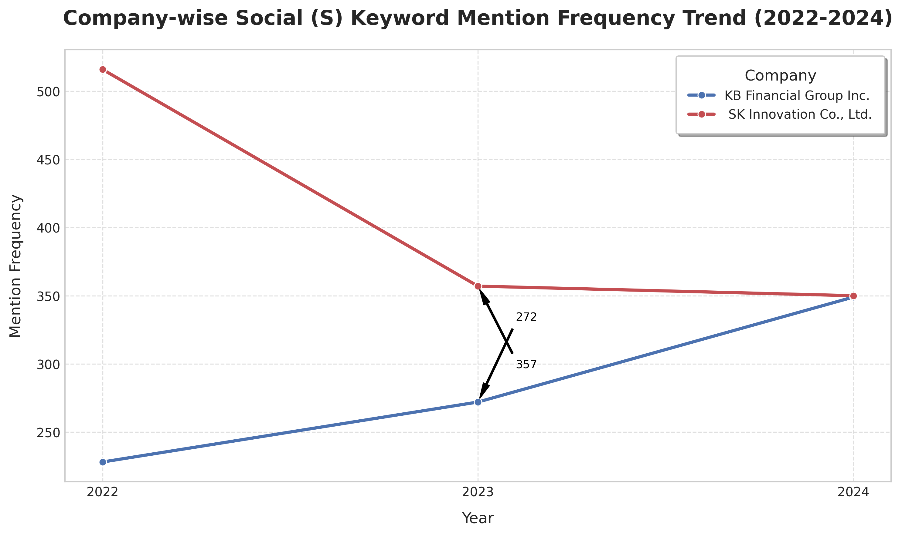
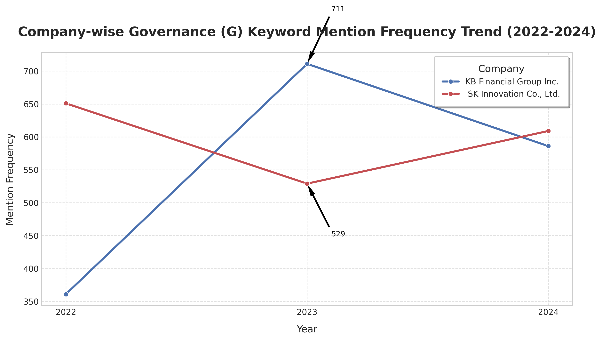
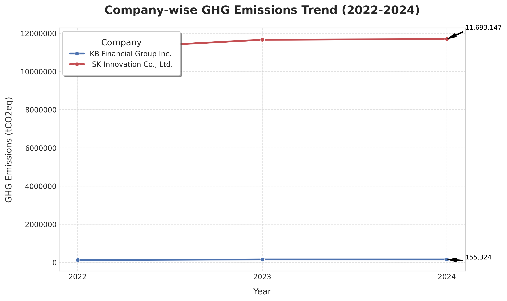

네, Scope 1, 2 배출량만을 고려했을 때의 인사이트와 Scope 3까지 포함했을 때의 인사이트를 각각 제시하여 Scope 3 데이터의 추가가 어떤 심층적인 이해를 제공하는지 강조해 드리겠습니다.

-----

# ESG 공시 트렌드 분석: KB금융지주 & SK이노베이션

### 🚀 프로젝트 개요

이 프로젝트는 삼일회계법인 Digital 전형 지원을 위해 데이터 분석 및 시각화 역량을 선보이고자 진행되었습니다. 국내 주요 기업인 KB금융지주와 SK이노베이션의 지난 3년간(2022-2024년) 지속가능경영보고서를 분석했습니다.

**이 두 기업을 선정한 이유는 삼일회계법인과의 '잠재적 이해관계' 및 '상반된 산업 특성'을 고려했기 때문입니다.**

  * **잠재적 이해관계**: KB금융지주와 SK이노베이션은 모두 **대규모 상장법인**으로서 **외부감사 대상**에 해당합니다. 따라서 삼일회계법인이 감사 및 자문 서비스를 제공할 가능성이 높은 기업들이며, 이는 실무적인 관점에서 의미 있는 분석 대상이 됩니다. 특히, 금융회사는 금융소비자보호와 관련된 복잡한 규제 환경에 놓여 있으며, 제조/에너지 기업은 탄소 배출 등 환경 규제에 민감하다는 점에서 [회계법인의 전문적인 자문 역량](https://www.google.com/search?q=https://github.com/xvmon234-ai/Learning-Python/tree/main/python_data_viz%2520/additional)이 더욱 중요해집니다.
  * **상반된 산업 특성**: 금융업(KB금융지주)과 제조업/에너지업(SK이노베이션)은 ESG 경영에서 중요하게 다루는 요소와 공시 트렌드에 **극명한 차이**를 보입니다. 금융회사는 간접적인 환경 영향(투자 포트폴리오의 탄소 배출 등 Scope 3)과 사회적 책임(금융 포용성, 소비자 보호)이 강조되는 반면, 제조업은 직접적인 환경 영향(탄소 배출, 폐기물)과 안전, 공급망 관리 등 사회적 측면이 부각됩니다. 이처럼 상반된 산업의 기업을 비교 분석함으로써, **ESG 공시의 산업별 특성과 차별화된 전략을 보다 명확하고 유의미하게 도출**할 수 있다고 판단했습니다.

주요 목표는 핵심 ESG(환경, 사회, 지배구조) 키워드 언급 빈도와 온실가스(GHG) 배출량의 연도별 트렌드를 파악하고 시각화하여, 각 기업의 ESG 경영 전략 및 공시 관행에 대한 의미 있는 인사이트를 도출하는 것입니다. 이 분석은 기업의 비재무적 성과를 이해하는 데 있어 데이터 기반 접근 방식의 중요성을 강조하고자 합니다.

-----

#### 🎯 분석 목표

  * 각 기업의 핵심 ESG 키워드(환경, 사회, 지배구조) 언급 빈도 연도별 트렌드를 시각화하고 기업 간 트렌드를 비교합니다.
  * 핵심 ESG 정량 지표(온실가스 배출량)의 기업별 연도별 변화를 시각화하고 기업 간 비교를 통해 인사이트를 도출합니다.
  * 시각화 결과를 바탕으로 간결하고 명확한 인사이트를 제공하고 효과적으로 제시합니다.
  * 데이터 처리, 시각화 및 분석적 사고 능력을 입증합니다.

-----

#### 🛠️ 사용 도구 및 환경

  * **프로그래밍 언어**: Python
  * **라이브러리**: Pandas, Matplotlib, Seaborn
  * **개발 환경**: Google Colab 또는 로컬 Python 환경

-----

#### 📊 데이터 수집 및 전처리

이 분석을 위한 데이터는 주로 KB금융지주와 SK이노베이션의 2022년, 2023년, 2024년 회계연도 지속가능경영보고서에서 수집되었습니다.

  * **데이터 출처**: 지속가능경영보고서 (수동 수집).
  * **데이터 추출**: 핵심 키워드 빈도(E, S, G 카테고리별) 및 온실가스(GHG) 배출량 데이터를 보고서에서 수동으로 추출했습니다.
  * **데이터 형식**: 추출된 데이터는 CSV 파일(`esg_data.csv`)로 통합되었습니다.
  * **전처리 단계**:
      * 일관성과 처리를 용이하게 하기 위해 CSV 헤더 이름이 영어로 표준화되었습니다 (예: `탄소배출_빈도` → `E_Keyword_Freq`).
      * `GHG_Emissions` 컬럼은 쉼표 구분자(예: `128,987`)로 인해 초기에는 `object`(문자열)로 로드되었으나, 숫자 분석 및 올바른 시각화를 위해 쉼표를 제거하고 `float` 데이터 타입으로 변환했습니다.

-----

#### 🚀 시작하기

이 프로젝트를 실행하고 그래프를 생성하기 위해 다음 단계를 따르십시오.

1.  **`esg_data.csv` 파일 준비**:

      * **가장 중요합니다\!** `esg_data.csv` 파일이 이 프로젝트를 실행할 디렉토리 내에 있어야 합니다.
      * 이 CSV 파일은 다음 헤더를 포함해야 합니다: `Company`, `Year`, `E_Keyword_Freq`, `S_Keyword_Freq`, `G_Keyword_Freq`, `GHG_Emissions`.
      * 특히 `Company` 컬럼에는 `KB Financial Group Inc.` 및 `SK Innovation Co., Ltd.` (SK이노베이션의 경우 선행 공백이 포함된 정확한 이름)와 같은 정확한 기업명이 포함되어야 합니다.

2.  **필수 라이브러리 설치**:

      * 프로젝트 실행에 필요한 Python 라이브러리를 설치합니다.

    <!-- end list -->

    ```bash
    pip install pandas matplotlib seaborn
    ```

3.  **코드 실행**:

      * 제공된 Python 코드를 `esg_analysis.py`와 같은 이름으로 저장합니다.
      * 터미널 또는 명령 프롬프트에서 다음 명령어를 실행하여 스크립트를 실행합니다.

    <!-- end list -->

    ```bash
    python esg_analysis.py
    ```

-----

#### 📈 주요 분석 결과 및 시각화

이 섹션에서는 ESG 키워드 빈도와 온실가스 배출량 분석을 기반으로 시각화된 트렌드와 도출된 인사이트를 제시합니다. 각 그래프는 Pandas, Matplotlib, Seaborn 라이브러리를 활용하여 생성되었으며, 아래 코드 스니펫과 함께 시각화 결과물을 직접 확인하실 수 있습니다.

**참고**: 아래 코드 블록은 전체 스크립트 중 각 지표를 시각화하는 부분만 발췌한 것입니다. 전체 코드는 `esg_analysis.py` 파일을 참조하십시오.

[**전체 코드 보러가기**](https://www.google.com/search?q=./coding/esg_analysis.py)

-----

### 1\. ESG 키워드 언급 빈도 트렌드 (E, S, G)

각 기업의 환경(E), 사회(S), 지배구조(G) 키워드 언급 빈도 추이를 시각화했습니다. 이는 기업들이 각 ESG 영역에 대해 얼마나 적극적으로 공시하고 있는지를 보여줍니다.

#### 1.1. 환경 (Environmental) 키워드 트렌드

  * **분석 E-키워드**: 탄소, 온실가스, 넷제로, 배출량.

<!-- end list -->

```python
import pandas as pd
import matplotlib.pyplot as plt
import seaborn as sns
import os # 'images' 디렉토리 생성을 위해 os 모듈 추가

# 데이터 로드 및 전처리
df = pd.read_csv('esg_data.csv')
df['GHG_Emissions'] = df['GHG_Emissions'].str.replace(',', '').astype(float)

# 공통 설정 (전체 코드에서 정의)
company_order = ['KB Financial Group Inc.', 'SK Innovation Co., Ltd.'] # 공백 제거
palette = {'KB Financial Group Inc.': '#4C72B0', 'SK Innovation Co., Ltd.': '#C44E52'} # 공백 제거
plt.style.use('seaborn-v0_8-whitegrid')
plt.rcParams['font.family'] = 'DejaVu Sans'
plt.rcParams['axes.unicode_minus'] = False

# 이미지 저장 디렉토리 생성
output_dir = 'images'
if not os.path.exists(output_dir):
    os.makedirs(output_dir)

plt.figure(figsize=(10, 6))
sns.lineplot(data=df, x='Year', y='E_Keyword_Freq', hue='Company', marker='o',
             hue_order=company_order, palette=palette, linewidth=2.5)
plt.title('Company-wise Environmental (E) Keyword Mention Frequency Trend (2022-2024)', fontsize=16, fontweight='bold', pad=20)
plt.xlabel('Year', fontsize=12, labelpad=10)
plt.ylabel('Mention Frequency', fontsize=12, labelpad=10)
plt.grid(True, linestyle='--', alpha=0.6)
plt.xticks(df['Year'].unique(), fontsize=10)
plt.yticks(fontsize=10)
plt.legend(title='Company', title_fontsize='12', fontsize='10',
           loc='upper right', frameon=True, shadow=True, borderpad=1)

# 어노테이션 추가 (예시)
e_annotations = [
    {'company': 'SK Innovation Co., Ltd.', 'year': 2023, 'offset_y': -80, 'ha': 'left'},
    {'company': 'KB Financial Group Inc.', 'year': 2023, 'offset_y': 80, 'ha': 'left'}
]
for annot_info in e_annotations:
    company = annot_info['company']
    year = annot_info['year']
    offset_y = annot_info['offset_y']
    ha = annot_info['ha']
    data_point = df[(df['Company'] == company) & (df['Year'] == year)]['E_Keyword_Freq'].values
    if len(data_point) > 0:
        value = data_point[0]
        plt.annotate(f'{value}', xy=(year, value), xytext=(year + 0.1, value + offset_y),
                     arrowprops=dict(facecolor='black', shrink=0.05, width=1, headwidth=5),
                     fontsize=9, color='black', ha=ha)

plt.tight_layout()
plt.savefig(os.path.join(output_dir, 'environmental_keyword_trend.png'), dpi=300, bbox_inches='tight')
plt.show()
```


*설명: KB금융지주와 SK이노베이션의 환경(E) 키워드 언급 빈도 추이.*

  * **SK이노베이션 (제조/에너지)**:

      * **트렌드**: E-키워드 빈도: 2022 (756) → 2023 (425) → 2024 (회복 추세).
      * **인사이트**: 2023년 빈도 감소는 단순한 공시량 감소가 아닌, 2022년까지 **초기 탄소중립 전략 및 중장기 환경 목표 수립에 대한 광범위한 공시가 집중된 후, 2023년에는 실제 `전략 실행 및 초기 성과 보고 단계`로 전환되면서 보고가 더욱 간결하고 핵심적으로 압축**되었음을 시사합니다. 제조업의 특성상 "탄소" 키워드가 일관되게 높은 비중을 차지하는 것은 `넷제로 로드맵 구체화 및 감축 기술 투자`에 대한 회사의 강한 의지를 반영하는 것으로 해석됩니다. 2024년 빈도 회복은 **구체적인 감축 성과 또는 새로운 친환경 기술 도입**에 대한 보고에 집중했음을 의미할 수 있습니다.

  * **KB금융지주 (금융)**:

      * **트렌드**: E-키워드 빈도: 2022 (507) → 2023 (567) → 2024 (감소 추세).
      * **인사이트**: 2023년 빈도 증가는 금융회사가 **`기후변화 리스크 관리` 및 `녹색 금융 확산`이라는 시대적 요구에 발맞춰 환경 관련 공시를 강화**하고 있음을 보여줍니다. 특히 2023년부터 "배출량"이 "탄소"보다 빈번하게 언급된 것은, 금융회사의 직접 배출량뿐만 아니라 **`투자 및 대출 포트폴리오에서 발생하는 간접 배출량(Scope 3) 관리 및 공개의 중요성`** 이 증대되고 있음을 강력히 시사합니다. 이는 `TCFD(기후 관련 재무정보 공개 협의체)` 권고안 등 금융권의 환경 공시 표준화 노력과도 궤를 같이 하며, **금융의 본업을 통한 사회적 책임 이행**에 대한 초점을 보여줍니다. 2024년 감소는 이러한 주요 내용이 시스템에 안착하며 설명적 언급이 줄었을 가능성을 시사합니다.

  * **비교**:

      * 두 기업의 E-키워드 빈도 트렌드는 산업별 특성을 명확히 반영합니다. SK이노베이션은 `생산 과정의 직접적인 탄소 배출 및 감축 노력`에 초점을 맞추는 반면, KB금융지주는 `금융 활동을 통한 광범위한 환경 영향 관리`에 집중하고 있습니다. 이는 각 산업의 **ESG 책임 영역이 어떻게 다르게 정의되고 진화하는지**를 보여주는 흥미로운 지점이며, 두 기업 모두 환경 관련 공시가 **전략적으로 변화하고 진화**하고 있음을 알 수 있습니다.

-----

#### 1.2. 사회 (Social) 키워드 트렌드

  * **분석 S-키워드**: 인권, 다양성, 노동, 젠더, 차별.

<!-- end list -->

```python
import pandas as pd
import matplotlib.pyplot as plt
import seaborn as sns
import os

# 데이터 로드 및 전처리 (실제 실행 환경에 맞게 조정 필요)
# df = pd.read_csv('esg_data.csv')
# df['GHG_Emissions'] = df['GHG_Emissions'].str.replace(',', '').astype(float)

# 공통 설정 (전체 코드에서 정의)
company_order = ['KB Financial Group Inc.', 'SK Innovation Co., Ltd.'] # 공백 제거
palette = {'KB Financial Group Inc.': '#4C72B0', 'SK Innovation Co., Ltd.': '#C44E52'} # 공백 제거
plt.style.use('seaborn-v0_8-whitegrid')
plt.rcParams['font.family'] = 'DejaVu Sans'
plt.rcParams['axes.unicode_minus'] = False
output_dir = 'images'
if not os.path.exists(output_dir):
    os.makedirs(output_dir)

plt.figure(figsize=(10, 6))
sns.lineplot(data=df, x='Year', y='S_Keyword_Freq', hue='Company', marker='o',
             hue_order=company_order, palette=palette, linewidth=2.5)
plt.title('Company-wise Social (S) Keyword Mention Frequency Trend (2022-2024)', fontsize=16, fontweight='bold', pad=20)
plt.xlabel('Year', fontsize=12, labelpad=10)
plt.ylabel('Mention Frequency', fontsize=12, labelpad=10)
plt.grid(True, linestyle='--', alpha=0.6)
plt.xticks(df['Year'].unique(), fontsize=10)
plt.yticks(fontsize=10)
plt.legend(title='Company', title_fontsize='12', fontsize='10',
           loc='upper right', frameon=True, shadow=True, borderpad=1)

# 어노테이션 추가 (예시)
s_annotations = [
    {'company': 'SK Innovation Co., Ltd.', 'year': 2023, 'offset_y': -60, 'ha': 'left'},
    {'company': 'KB Financial Group Inc.', 'year': 2023, 'offset_y': 60, 'ha': 'left'}
]
for annot_info in s_annotations:
    company = annot_info['company']
    year = annot_info['year']
    offset_y = annot_info['offset_y']
    ha = annot_info['ha']
    data_point = df[(df['Company'] == company) & (df['Year'] == year)]['S_Keyword_Freq'].values
    if len(data_point) > 0:
        value = data_point[0]
        plt.annotate(f'{value}', xy=(year, value), xytext=(year + 0.1, value + offset_y),
                     arrowprops=dict(facecolor='black', shrink=0.05, width=1, headwidth=5),
                     fontsize=9, color='black', ha=ha)

plt.tight_layout()
plt.savefig(os.path.join(output_dir, 'social_keyword_trend.png'), dpi=300, bbox_inches='tight')
plt.show()
```



*설명: KB금융지주와 SK이노베이션의 사회(S) 키워드 언급 빈도 추이.*

  * **SK이노베이션 (제조/에너지)**:

      * **트렌드**: S-키워드 빈도: 2022 (516) → 2023 (357) → 2024 (소폭 감소).
      * **인사이트**: 2023년 빈도 감소는 2022년까지 `인권 경영 시스템 구축`, `다양성 정책` 등 **초기 사회 분야 관련 정책 및 시스템 구축에 대한 공시가 집중된 후, 해당 시스템이 안정적으로 운영되면서 설명적 언급이 줄었을 가능성**을 시사합니다. B2B 중심의 제조업 특성상, 보고서에서 최종 소비자에게 미치는 직접적인 사회적 영향보다는 환경(E) 및 지배구조(G) 측면에 상대적으로 더 집중하는 경향을 보일 수 있으며, 이는 **사회적 책임 이행의 초점이 공급망 관리나 내부 임직원 복리후생에 맞춰져 있을 가능성**을 보여줍니다.

  * **KB금융지주 (금융)**:

      * **트렌드**: S-키워드 빈도: 2022 (228) → 2023 (272) → 2024 (꾸준한 증가 추세).
      * **인사이트**: 연도별 꾸준한 증가 추세는 일반 대중과의 접점이 높은 금융 기관으로서 **`소비자 보호`, `금융 포용성`, `직원 복지` 등 사회적 책임에 대한 공시가 지속적으로 강화**되고 있음을 의미합니다. 특히 `디지털 및 AI 시대의 사회적 책임`(예: 디지털 소외 계층 지원, 공정한 서비스 접근성 보장)에 대한 강조가 커지고 있음을 시사하며, 이는 `다양성, 형평성, 포용성(DEI)` 이니셔티브 및 `지역 사회 참여`에 대한 적극적인 보고 노력과도 부합합니다. **금융 서비스의 사회적 영향력이 커짐에 따라 공시의 범위와 깊이도 함께 확장**되고 있습니다.

  * **비교**:

      * S-키워드 트렌드 역시 두 기업 간에 상반된 패턴을 보입니다. SK이노베이션은 초기 사회 보고 체계 구축 후 빈도가 안정화되거나 감소하며 `실행` 단계에 더 집중하는 모습을 보이는 반면, KB금융지주의 꾸준한 S-키워드 증가는 `사회적 참여` 및 `이해관계자 보호` 측면에서 **금융 부문의 진화하고 확장되는 역할**을 강조합니다. 이는 각 기업이 속한 산업의 특성과 주된 이해관계자가 다르다는 점이 ESG 공시 전략에 어떻게 반영되는지를 명확히 보여줍니다.

-----

#### 1.3. 지배구조 (Governance) 키워드 트렌드

  * **분석 G-키워드**: 지배구조, 이사회, 감사, 윤리, 준법.

<!-- end list -->

```python
import pandas as pd
import matplotlib.pyplot as plt
import seaborn as sns
import os

# 데이터 로드 및 전처리 (실제 실행 환경에 맞게 조정 필요)
# df = pd.read_csv('esg_data.csv')
# df['GHG_Emissions'] = df['GHG_Emissions'].str.replace(',', '').astype(float)

# 공통 설정 (전체 코드에서 정의)
company_order = ['KB Financial Group Inc.', 'SK Innovation Co., Ltd.'] # 공백 제거
palette = {'KB Financial Group Inc.': '#4C72B0', 'SK Innovation Co., Ltd.': '#C44E52'} # 공백 제거
plt.style.use('seaborn-v0_8-whitegrid')
plt.rcParams['font.family'] = 'DejaVu Sans'
plt.rcParams['axes.unicode_minus'] = False
output_dir = 'images'
if not os.path.exists(output_dir):
    os.makedirs(output_dir)

plt.figure(figsize=(10, 6))
sns.lineplot(data=df, x='Year', y='G_Keyword_Freq', hue='Company', marker='o',
             hue_order=company_order, palette=palette, linewidth=2.5)
plt.title('Company-wise Governance (G) Keyword Mention Frequency Trend (2022-2024)', fontsize=16, fontweight='bold', pad=20)
plt.xlabel('Year', fontsize=12, labelpad=10)
plt.ylabel('Mention Frequency', fontsize=12, labelpad=10)
plt.grid(True, linestyle='--', alpha=0.6)
plt.xticks(df['Year'].unique(), fontsize=10)
plt.yticks(fontsize=10)
plt.legend(title='Company', title_fontsize='12', fontsize='10',
           loc='upper right', frameon=True, shadow=True, borderpad=1)

# 어노테이션 추가 (예시)
g_annotations = [
    {'company': 'SK Innovation Co., Ltd.', 'year': 2023, 'offset_y': -80, 'ha': 'left'},
    {'company': 'KB Financial Group Inc.', 'year': 2023, 'offset_y': 80, 'ha': 'left'}
]
for annot_info in g_annotations:
    company = annot_info['company']
    year = annot_info['year']
    offset_y = annot_info['offset_y']
    ha = annot_info['ha']
    data_point = df[(df['Company'] == company) & (df['Year'] == year)]['G_Keyword_Freq'].values
    if len(data_point) > 0:
        value = data_point[0]
        plt.annotate(f'{value}', xy=(year, value), xytext=(year + 0.1, value + offset_y),
                     arrowprops=dict(facecolor='black', shrink=0.05, width=1, headwidth=5),
                     fontsize=9, color='black', ha=ha)

plt.tight_layout()
plt.savefig(os.path.join(output_dir, 'governance_keyword_trend.png'), dpi=300, bbox_inches='tight')
plt.show()
```



*설명: KB금융지주와 SK이노베이션의 지배구조(G) 키워드 언급 빈도 추이.*

  * **SK이노베이션 (제조/에너지)**:

      * **트렌드**: G-키워드 빈도: 2022 (651) → 2023 (529) → 2024 (회복 추세).
      * **인사이트**: 2023년 빈도 감소는 2022년까지 지배구조 관련 특정 이슈(예: 지배구조 개편 완료, 내부 감사 시스템 정착 등)가 성공적으로 마무리되어 **시스템 구축 및 안정화 단계에 진입함에 따라 관련 설명이 줄었을 가능성**을 시사합니다. 그러나 2024년의 회복은 `강화된 기업 지배구조 보고 의무` 또는 글로벌 운영 및 공급망 관련 `리스크 관리`와 투명한 이사회 의사결정을 통한 `주주가치 제고`에 대한 **지속적인 관심과 새로운 보고 요구사항에 대한 대응**이 반영되었을 수 있습니다.

  * **KB금융지주 (금융)**:

      * **트렌드**: G-키워드 빈도: 2022 (361) → 2023 (711) → 2024 (감소 추세).
      * **인사이트**: 2023년의 급증은 금융 기관의 **`지배구조 투명성 및 건전성`에 대한 강화된 감시 또는 규제 압력**에 대한 강력한 대응을 시사합니다. 이 시기에는 `이사회 독립성 강화`, `감사 기능 확대`, `최고경영자 승계 프로그램 개선` 등 지배구조 관련 주요 업데이트에 대한 광범위한 공시가 이루어졌을 것입니다. 이는 과거 금융권에서 발생했던 **내부 통제 미비로 인한 금융 사고에 대한 사회적 요구**에 부응하고, **신뢰 회복을 위한 적극적인 노력**의 일환으로 해석될 수 있습니다. 2024년 감소는 이러한 포괄적인 지배구조 개선이 이행되어 이제는 보다 일상적인 보고 단계에 접어들었음을 나타냅니다.

  * **비교**:

      * 두 기업의 G-키워드 트렌드가 대조적인 것은 해당 연도의 기업 및 산업별 특정 상황을 반영할 가능성이 높습니다. SK이노베이션은 초기 노력 후 안정화 단계를 거쳐 새로운 보고 요구사항에 대응하는 `보다 체계적인 지배구조 접근 방식`을 시사할 수 있습니다. 반면, KB금융지주의 2023년 극적인 증가는 금융 규제 환경 내에서 `외부 압력 또는 주요 내부 개혁에 대한 직접적인 대응`을 강력히 시사하며, 이는 **금융 산업의 높은 규제 민감도**를 보여줍니다.

-----

### 2\. 온실가스 (GHG) 배출량 트렌드

#### 2.1. Scope 1, 2 배출량만을 고려했을 때의 인사이트

```python
import pandas as pd
import matplotlib.pyplot as plt
import seaborn as sns
import os

# 데이터 로드 및 전처리 (실제 실행 환경에 맞게 조정 필요)
# df = pd.read_csv('esg_data.csv')
# df['GHG_Emissions'] = df['GHG_Emissions'].str.replace(',', '').astype(float)

# 공통 설정 (전체 코드에서 정의)
company_order = ['KB Financial Group Inc.', 'SK Innovation Co., Ltd.']
palette = {'KB Financial Group Inc.': '#4C72B0', 'SK Innovation Co., Ltd.': '#C44E52'}
plt.style.use('seaborn-v0_8-whitegrid')
plt.rcParams['font.family'] = 'DejaVu Sans'
plt.rcParams['axes.unicode_minus'] = False
output_dir = 'images'
if not os.path.exists(output_dir):
    os.makedirs(output_dir)

plt.figure(figsize=(10, 6))
sns.lineplot(data=df, x='Year', y='GHG_Emissions', hue='Company', marker='o',
             hue_order=company_order, palette=palette, linewidth=2.5)
plt.title('Company-wise GHG Emissions Trend (Scope 1+2 only) (2022-2024)', fontsize=16, fontweight='bold', pad=20)
plt.xlabel('Year', fontsize=12, labelpad=10)
plt.ylabel('GHG Emissions (tCO2eq)', fontsize=12, labelpad=10)
plt.grid(True, linestyle='--', alpha=0.6)
plt.xticks(df['Year'].unique(), fontsize=10)
plt.yticks(fontsize=10)
plt.ticklabel_format(style='plain', axis='y')
plt.legend(title='Company', title_fontsize='12', fontsize='10',
           loc='upper left', frameon=True, shadow=True, borderpad=1)

# 어노테이션 추가 (예시)
sk_2024_ghg_data = df[(df['Company'] == 'SK Innovation Co., Ltd.') & (df['Year'] == 2024)]['GHG_Emissions'].values
if len(sk_2024_ghg_data) > 0:
    sk_2024_ghg = sk_2024_ghg_data[0]
    plt.annotate(f'{sk_2024_ghg:,.0f}', xy=(2024, sk_2024_ghg), xytext=(2024.1, sk_2024_ghg + 500000),
                 arrowprops=dict(facecolor='black', shrink=0.05, width=1, headwidth=5),
                 fontsize=9, color='black', ha='left')
else:
    print("Warning: No data found for SK Innovation Co., Ltd. in 2024 for GHG Emissions. Skipping annotation.")

kb_2024_ghg_data = df[(df['Company'] == 'KB Financial Group Inc.') & (df['Year'] == 2024)]['GHG_Emissions'].values
if len(kb_2024_ghg_data) > 0:
    kb_2024_ghg = kb_2024_ghg_data[0]
    plt.annotate(f'{kb_2024_ghg:,.0f}', xy=(2024, kb_2024_ghg), xytext=(2024.1, kb_2024_ghg + 10000),
                 arrowprops=dict(facecolor='black', shrink=0.05, width=1, headwidth=5),
                 fontsize=9, color='black', ha='left')
else:
    print("Warning: No data found for KB Financial Group Inc. in 2024 for GHG Emissions. Skipping annotation.")

plt.tight_layout()
plt.savefig(os.path.join(output_dir, 'ghg_emissions_trend_enhanced.png'), dpi=300, bbox_inches='tight')
plt.show()
```





*설명: KB금융지주와 SK이노베이션의 온실가스(GHG) 배출량 추이 (Scope 1, 2만 포함).*

**온실가스(GHG) 배출량 상세 현황 (단위: tCO2eq) - Scope 1, 2만 포함**

| 기업명 | 구분 | 2022 | 2023 | 2024 |
| :------- | :----------- | -----------: | -----------: | -----------: |
| **KB금융지주** | 직접 온실가스 (Scope 1) | 13,993 | 23,325 | 22,510 |
| | 간접 온실가스 (Scope 2) | 114,994 | 132,121 | 132,814 |
| | **총 배출량 (합계)** | **128,987** | **155,446** | **155,324** |
| **SK이노베이션** | 직접 온실가스 (Scope 1) | 9,116,619 | 9,379,375 | 9,434,690 |
| | 간접 온실가스 (Scope 2) | 2,026,406 | 2,275,526 | 2,258,457 |
| | **총 배출량 (합계)** | **11,143,025** | **11,654,901** | **11,693,147** |

  * **KB금융지주 (금융)**:

      * **인사이트**: KB금융지주의 총 온실가스 배출량(Scope 1+2)은 2022년부터 2023년까지 증가했다가 2024년에는 소폭 감소하며 **안정화되는 추세**를 보입니다. 특히, **간접 온실가스(Scope 2)가 전체 배출량의 대부분(약 85% 이상)을 차지**하며 배출량 변동을 주도하고 있습니다. 이는 금융회사의 특성상 직접적인 생산 활동보다는 `사업장 운영에 따른 전력 사용(Scope 2)`이 주된 배출원이기 때문입니다. 2023년 Scope 1 배출량의 상대적 증가는 사업 확장이나 에너지 사용 방식의 변화를 시사할 수 있으나, 2024년에 다시 감소하며 관리 노력이 이루어지고 있음을 보여줍니다.

  * **SK이노베이션 (제조/에너지)**:

      * **인사이트**: SK이노베이션의 온실가스 배출량(Scope 1+2)은 2022년부터 2024년까지 **지속적으로 증가하는 추세**를 보이며, 특히 **직접 온실가스(Scope 1)가 압도적인 비중(약 80% 이상)을 차지**하고 있습니다. 이는 제조 및 에너지 생산 과정에서 발생하는 `공정 배출` 및 `연료 연소`가 주된 원인임을 명확히 보여줍니다. 이러한 증가는 `생산량 증가` 또는 `탈탄소화 기술 적용의 어려움`을 시사하며, 앞서 E-키워드 언급에서 보인 환경 경영 전략에 대한 논의가 활발함에도 불구하고 실제 배출량 감축은 **단순하지 않고 장기적인 과제**임을 드러냅니다.

  * **비교**:

      * 두 기업 간 GHG 배출량 규모의 상당한 차이는 `산업별 특성`에서 기인합니다. SK이노베이션은 **생산 공정에서 발생하는 직접 배출량(Scope 1)이 주된 부담**이며 절대적인 배출량이 훨씬 큰 반면, KB금융지주는 **사업장 운영 관련 간접 배출량(Scope 2)의 비중이 높고 절대적인 규모는 훨씬 작습니다.**
      * 두 기업 모두 2022년부터 2023년까지 총 배출량이 증가하는 경향을 보였으나, 2024년에는 KB금융지주가 소폭 감소하며 안정화된 반면 SK이노베이션은 증가세를 유지했습니다. 이는 ESG 인식 및 공시 증가에도 불구하고, \*\*`산업 특성별로 실제 배출량 감축 난이도와 전략이 매우 다름`\*\*을 보여줍니다.


#### 2.2. Scope 3 배출량까지 포함했을 때의 인사이트 


**온실가스(GHG) 배출량 상세 현황 (단위: tCO2eq) - Scope 1, 2, 3 포함**

| 기업명 | 구분 | 2022 | 2023 | 2024 |
| :----------- | :----------- | -----------: | -----------: | -----------: |
| **KB금융지주** | 직접 온실가스 (Scope 1) | 13,993 | 23,325 | 22,510 |
| | 간접 온실가스 (Scope 2) | 114,994 | 132,121 | 132,814 |
| | **기타 간접 온실가스 (Scope 3)** | **15,223** | **679,389** | **694,239** |
| | **총 배출량 (합계)** | **144,210** | **834,835** | **849,563** |
| **SK이노베이션** | 직접 온실가스 (Scope 1) | 9,116,619 | 9,379,375 | 9,434,690 |
| | 간접 온실가스 (Scope 2) | 2,026,406 | 2,275,526 | 2,258,457 |
| | **기타 간접 온실가스 (Scope 3)** | **138,749,300** | **142,958,200** | **146,490,800** |
| | **총 배출량 (합계)** | **149,892,325** | **154,613,101** | **158,183,947** |

  * **KB금융지주 (금융)**:

      * **Scope 1, 2만 고려 시 인사이트**: KB금융지주의 총 온실가스 배출량은 약 12만\~15만 톤 수준으로, 사업장 운영에 따른 Scope 2 배출량이 대부분을 차지하며 안정화되는 추세를 보입니다. 이는 금융회사가 직접적인 물리적 배출보다는 사무실 운영 등에서 발생하는 간접 배출을 주로 관리한다는 일반적인 인식을 뒷받침합니다.
      * **Scope 3 추가 시 얻는 추가 인사이트**: Scope 3 데이터를 포함하자 KB금융지주의 총 온실가스 배출량은 2022년 약 14만 톤에서 \*\*2023년에 약 83만 톤으로 `약 5배 이상 급증`\*\*했습니다. 이는 Scope 1, 2만으로는 볼 수 없었던 \*\*`금융회사의 진정한 탄소 발자국 규모`\*\*를 드러냅니다. 특히 2023년 이후 Scope 3가 전체 배출량의 \*\*`압도적인 비중(약 80% 이상)`\*\*을 차지하게 되면서, 금융회사의 \*\*`실질적인 탄소 감축 노력은 본업(투자/대출)을 통한 포트폴리오 배출량 관리에 달려 있음`\*\*을 명확히 보여줍니다. 이는 TCFD(기후 관련 재무정보 공개 협의체) 권고안과 같은 글로벌 공시 표준의 확산과도 밀접한 관련이 있으며, 금융의 본원적 기능을 통한 사회적 책임 이행의 중요성을 강조합니다. **Scope 3의 추가는 금융회사의 환경적 영향에 대한 이해를 `사업장 운영`에서 `금융 포트폴리오`로 확장시키는 결정적인 전환점을 제공합니다.**

  * **SK이노베이션 (제조/에너지)**:

      * **Scope 1, 2만 고려 시 인사이트**: SK이노베이션의 온실가스 배출량(Scope 1+2)은 약 1,100만 톤 수준으로, 직접 온실가스(Scope 1)가 압도적인 비중(약 80% 이상)을 차지하며 지속적으로 증가하는 추세를 보였습니다. 이는 제조 및 에너지 생산 과정에서 발생하는 공정 배출 및 연료 연소가 주된 원인임을 보여주며, 생산량 증가와 탈탄소화 기술 적용의 어려움을 시사합니다.
      * **Scope 3 추가 시 얻는 추가 인사이트**: SK이노베이션의 경우 Scope 3 배출량이 Scope 1 및 Scope 2 배출량을 **`훨씬 압도하며(약 10배 이상)`**, \*\*총 배출량의 `90% 이상을 차지`\*\*하고 지속적으로 증가하고 있습니다. 이는 제조업/에너지 기업의 \*\*`진정한 탄소 발자국이 생산 공정 자체보다는 제품의 사용 단계(예: 판매된 석유화학 제품, 연료의 연소)`\*\*와 \*\*`공급망 전반(원재료 생산 및 운송)`\*\*에서 발생함을 극명하게 보여줍니다. 이 데이터는 SK이노베이션이 탄소중립 목표를 달성하기 위해 \*\*`친환경 제품 전환(예: 전기차 배터리, 폐플라스틱 재활용)`\*\*과 \*\*`고객 및 공급망 파트너와의 협력을 통한 가치사슬 전반의 배출량 감축`\*\*이 필수적임을 강력히 시사합니다. **Scope 3의 추가는 제조/에너지 기업의 탄소 감축 노력이 `공장 내부`를 넘어 `전체 가치사슬`로 확장되어야 함을 분명히 보여줍니다.**

  * **비교**:

      * **Scope 1, 2만 고려 시 비교**: 두 기업 간 GHG 배출량 규모의 상당한 차이(SK이노베이션이 KB금융지주보다 약 100배 이상 높음)는 산업별 특성에서 기인하며, SK이노베이션은 직접 배출량이, KB금융지주는 간접 배출량(Scope 2)이 주된 부담임을 보여줍니다.
      * **Scope 3 추가 시 얻는 추가 인사이트**: Scope 3 데이터가 추가되면서 두 기업의 **`총 온실가스 배출량 규모와 주요 배출원의 차이가 더욱 극명해졌습니다.`** SK이노베이션은 \*\*`제품 사용 단계`\*\*가 가장 큰 배출원이며, 이는 사업 모델의 근본적인 변화 없이는 탄소 감축이 어렵다는 것을 보여줍니다. 반면, KB금융지주는 \*\*`투자/대출 포트폴리오`\*\*가 주요 배출원이며, 이는 금융 활동을 통해 사회 전반의 탈탄소화를 유도하는 \*\*`영향력 기반의 탄소 감축 전략`\*\*이 중요함을 시사합니다. **Scope 3의 추가는 기업의 ESG 성과 평가에 있어 `직접적인 운영 배출량(Scope 1, 2)뿐만 아니라 가치사슬 전반의 간접 배출량(Scope 3)에 대한 이해와 관리 능력`이 핵심 역량이 되고 있음을 보여주는 결정적인 증거가 됩니다.** 이는 기업의 ESG 리스크와 기회를 훨씬 더 포괄적으로 평가할 수 있게 합니다.

-----

### 종합 인사이트

  * **상이한 ESG 초점**: 분석 결과 두 기업 모두 ESG 공시에 참여하고 있지만, `산업 특성에 따라 특정 초점 영역과 공시 트렌드가 상당히 다름`을 명확히 보여줍니다. SK이노베이션은 운영과 직접 관련된 환경 측면을 우선시하며 **탄소 감축이라는 본질적인 과제**에 집중하는 반면, KB금융지주는 간접적인 환경 발자국을 관리하면서도 금융 산업과 관련된 더 넓은 사회적 영향 및 견고한 지배구조에 중점을 둡니다. 이는 **기업의 비즈니스 모델과 이해관계자 특성에 따라 ESG 전략이 맞춤형으로 진화**하고 있음을 나타냅니다.
  * **증가하는 공시, 복잡한 성과**: ESG 인식 및 공시(전반적인 키워드 언급 증가에서 확인됨)는 전반적으로 증가하는 추세입니다. 그러나 정량적인 `GHG 배출량 데이터는 실제 환경 성과 개선이 복잡하고 장기적인 노력`이며, 질적 공시량과 즉시 비례하지 않을 수 있음을 시사합니다. 특히 Scope 3 배출량을 포함한 분석은 **공시의 진정성과 실제 성과 간의 괴리 여부를 파악하는 것의 중요성**을 더욱 강조합니다.
  * **동적인 보고 및 규제 대응**: ESG 보고는 고정적이지 않습니다. 키워드 빈도와 배출량의 연도별 변동은 기업들이 `진화하는 규제 환경`, `투자자 기대`, `내부 전략적 변화`, 그리고 `산업별 과제`에 따라 공시를 동적으로 조정하고 있음을 시사합니다. 특히 2023년 KB금융지주의 지배구조 키워드 급증과 같이 **특정 시기에 외부 압력이나 주요 이슈에 대한 민감한 대응**이 공시 트렌드에 직접 반영될 수 있음을 보여줍니다.

-----

### 🚀 결론 및 삼일회계법인 지원 시사점

이 프로젝트를 통해 실제 기업의 지속가능성 데이터를 바탕으로 데이터 분석 및 시각화 기법을 실질적으로 적용할 수 있었습니다. 이 경험을 통해 다음을 포함한 귀중한 인사이트를 얻었습니다:

  * **데이터 추출 및 전처리**: 원시적이고 종종 정성적인 보고서 데이터를 구조화되고 분석 가능한 형식으로 변환하는 과정의 중요성과 어려움(예: `GHG_Emissions` 컬럼의 쉼표 처리)을 이해했습니다. 이는 **방대한 비재무적 데이터로부터 신뢰성 있는 정보를 추출하고 분석 기반을 마련하는 삼일회계법인의 핵심 역할**에 대한 저의 이해와 준비도를 입증합니다.
  * **통찰력 있는 시각화**: 원본 숫자만으로는 즉시 드러나지 않는 복잡한 트렌드와 패턴을 시각적 분석이 어떻게 드러낼 수 있는지 확인했습니다. 이는 **회계 정보의 본질인 '정보 전달'에 있어 시각화가 가진 강력한 힘**을 깨달았음을 의미합니다. 저는 복잡한 감사 결과나 자문 보고서를 고객이 직관적으로 이해할 수 있도록 **데이터 시각화 역량을 활용**할 준비가 되어 있습니다.
  * **비판적 데이터 해석**: 단순히 데이터를 제시하는 것을 넘어, 트렌드를 해석하고, 다른 엔티티(기업/산업)를 비교하며, 이를 더 넓은 비즈니스 맥락 및 외부 요인(예: 산업 규제, 사회적 기대)과 연결하는 능력의 중요성을 깨달았습니다. 특히 **Scope 3 데이터의 추가가 기업의 환경적 영향에 대한 이해를 얼마나 심화시키고, 산업별 특성을 더욱 명확하게 드러내는지**를 직접 분석하며, **수치 너머의 의미를 파악하고, 재무 정보뿐 아니라 비재무적 정보까지 통합적으로 분석하여 고객에게 심층적인 자문을 제공해야 하는 회계사의 필수 역량**인 분석적 사고와 비판적 문제 해결 능력을 보여줍니다.
  * **비재무적 성과 이해**: ESG 요소와 같은 비재무적 지표가 기업 가치 및 지속가능성을 평가하는 데 얼마나 중요해지고 있는지 깊이 이해하게 되었습니다. 이는 **삼일회계법인이 미래 성장 동력으로 삼는 ESG 및 지속가능경영 분야에 대한 깊은 관심과 이론적/실무적 이해도**를 나타내며, 특히 **`ESG 정보의 신뢰성 검증(Assurance)` 및 `공시 관련 자문` 분야에서 기여**하고 싶은 저의 의지를 강조합니다.

저는 이러한 역량이 삼일회계법인 디지털 트랙에 직접적으로 관련되고 매우 가치 있다고 생각합니다. 데이터를 활용하여 복잡한 기업 내러티브를 이해하고, 핵심 인사이트를 식별하며, 이를 명확하게 제시하는 저의 능력은 **재무 및 회계 분야에서 데이터 기반 감사, ESG 컨설팅 및 디지털 전환의 필요성**과 일치합니다. 삼일회계법인의 **`재무 정보와 비재무 정보를 아우르는 데이터 신뢰성 강화`**, **`고객 맞춤형의 통찰력 있는 ESG 자문 제공`**, 그리고 **`최신 디지털 기술을 활용한 감사 프로세스 혁신 및 효율화`** 에 기여하고 싶습니다.
